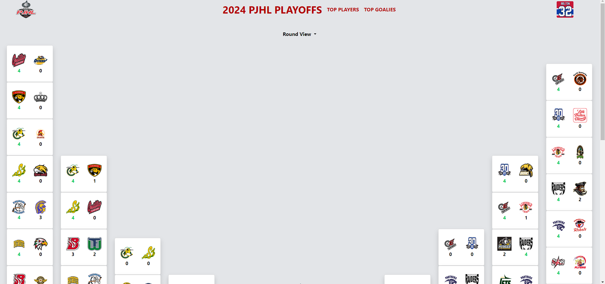
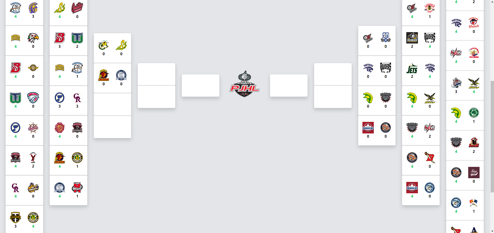
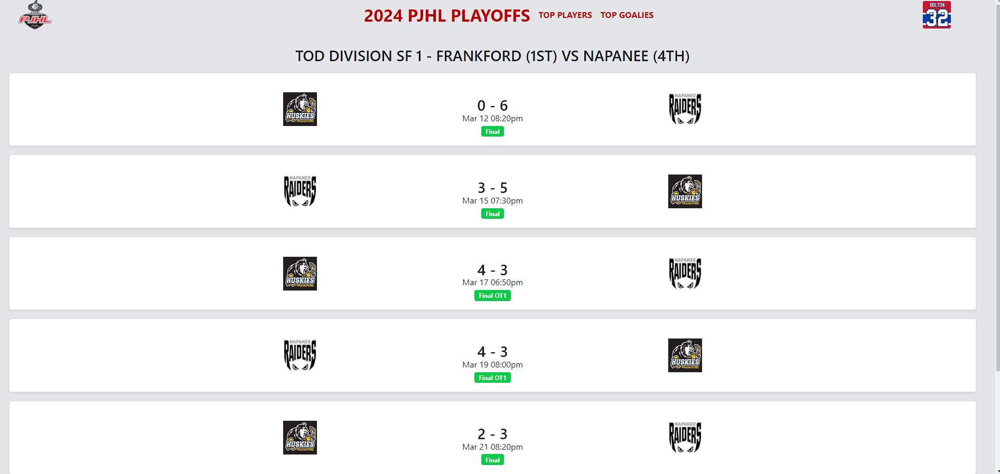
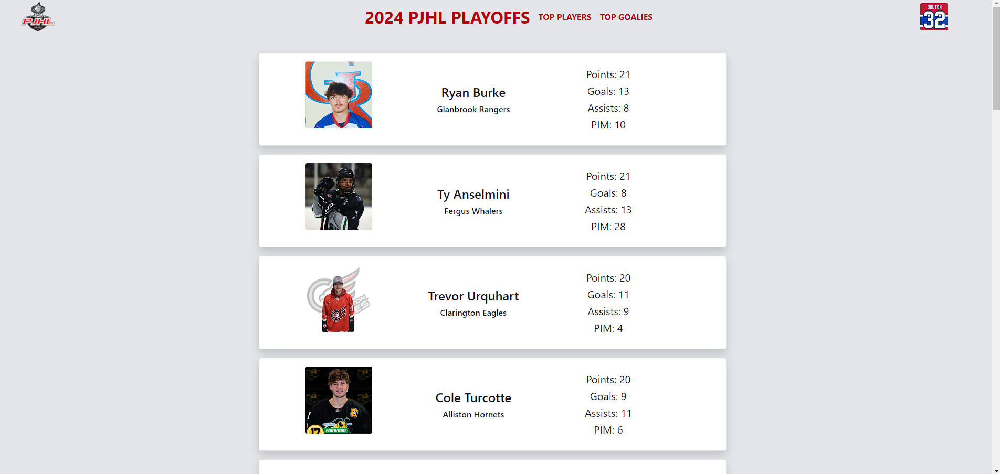
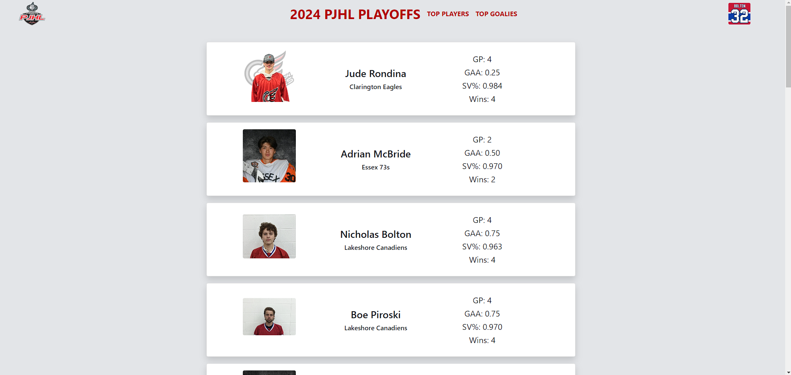
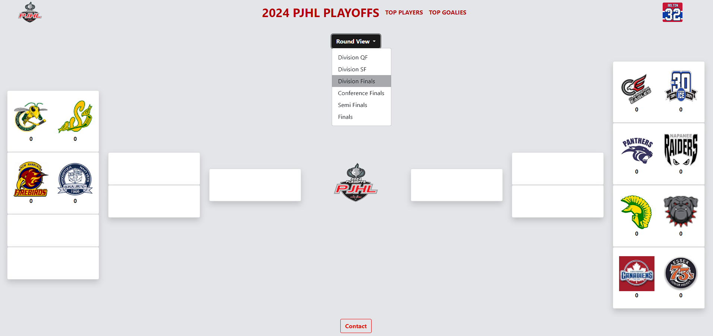

# Road To Schmalz

[https://roadtoschmalz.ca](https://roadtoschmalz.ca)

# About
This web app was built as a playoff tracker for the 2023-2024 PJHL season. It uses endpoints I discovered on the [PJHL website](https://thepjhl.ca) so that it updates automatically.

It has different round views (mainly for the mobile side) so that one can focus on certain depths in the playoffs. One can also view a matchup's game dates by clicking on the desired matchup. A live indicator is displayed on each matchup and each matchup game whenever a game is currently being played.

One can also view the leading players and goaltenders across the entire league. The players are automatically sorted by points while the goals are sorted by GAA. I was planning on adding different sort options but decided to keep it simple. One can always view specifics by going on the actual PJHL website anyway.

Clicking on any player/goalie/game will bring them to that player/goalie/game's page on the PJHL website.

# How the App Looks
Obviously this app is only "live" while the PJHL playoff season is live. Here are some images of what it looks like in the middle of the season.

### Home Page (1/2)

### Home Page (2/2)

### Matchup Page

### Top Players

### Top Goalies

### Home Page with Round View Level
